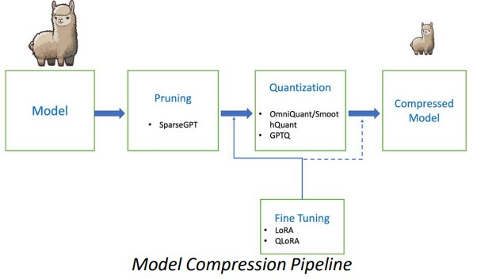

# Edge LLM - Reducing LLM Memory Footprint to < 2GB

This project is the Engineering Entrepreneurial Capstone at the University of Washington, sponsored by Amazon.

## Project Team

- **Mentors:** 
  - Manohara Mansi
  - Dayal Sankalp
  - Larry Arnstein
- **Participants:**
  - Yao Zhang
  - Chaitanya Krishna Mullapudi
  - Kunping Yan
  - Vincent Wang
  - James Yao
  - Sai Jayanth Kalisi
  - Yaobin Xie

## Project Objective

The objective of this project is to deploy a Language Model (LLM) on consumer edge devices, specifically RK devices. The goal is to facilitate on-device language processing without the need for constant internet connectivity. The key objectives include:

- Addressing the growing demand for privacy-conscious, low-latency, and reliable language processing directly on consumer devices.

- Eliminating the need for continuous cloud connectivity, ensuring data security, and reducing latency for a smoother and more reliable user experience.

- Demonstrating the feasibility of running an LLM on consumer edge devices through a proof of concept.

## Approach



1. **Inference on Llama 7B and Mistral 7B:**
   - Run inference and validate performance for storytelling, summarization, and math Q&A tasks.

2. **Integer Weight Quantization:**
   - Utilize techniques such as Smooth Quant or Omni Quant to perform integer weight quantization.
   - Reduce weights to 4 bits for 16 bits to achieve a factor of 4 reduction.

3. **Fine-Tuning Based Pruning:**
   - Implement techniques like SparseGPT for fine-tuning based pruning.
   - Reduce the count of weights by 50% to achieve approximately 7x reduction.

4. **Model Serialization and Compilation:**
   - Serialize the model and compile it to run inference on Orange Pi using SDKs such as Open CL and RKNN.

## How to Use


### Using HTTP-server with self-designed user interface

1. Using 'make' to create binary in llama.cpp: 

   `make server`

2. Start a server that by default listens on 127.0.0.1:8080: 

   `./server -m models/7B/ggml-model.gguf -c 2048`

3. Consume the endpoints with Postman or NodeJS: 

```
   url = "http://127.0.0.1:8080/completion"

   data = {
      "prompt": "What is the capital of spain?",
      "n_predict": 256,  # Set the maximum number of tokens to predict to 64
   }

   # Send the POST request
   response = requests.post(url, json=data)
```


## License


## Acknowledgments


